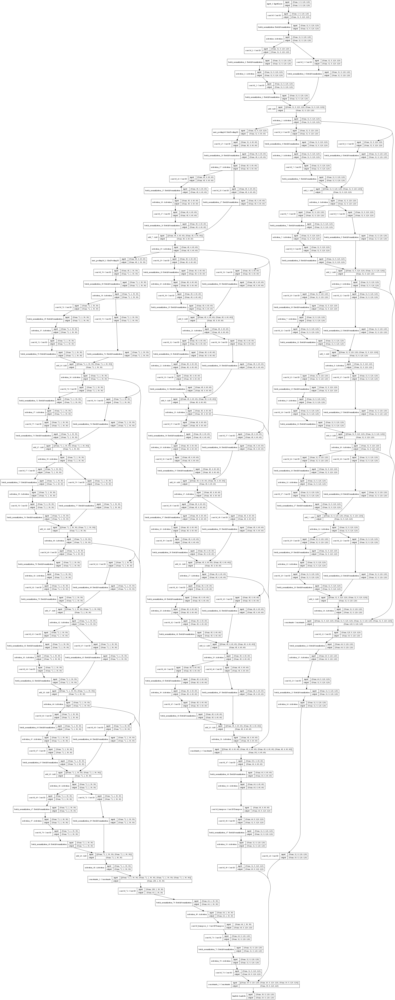

## Introduce
Reproduce HD-Net (Hierarchical Dilated Network) with Keras

## Model

#### Plotted by `keras.utils.vis_utils.plot_model()`:

## Reference
[Zhou S, Nie D, Adeli E, et al. Fine-Grained Segmentation Using Hierarchical Dilated Neural Networks[J]. 2018:488-496.](https://www.researchgate.net/publication/327629577_Fine-Grained_Segmentation_Using_Hierarchical_Dilated_Neural_Networks_21st_International_Conference_Granada_Spain_September_16-20_2018_Proceedings_Part_IV)